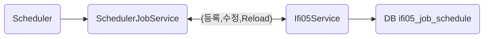

# Asset-Api

## 개요

- 제휴회사들에 api서비스, Asset-Erp와 별도로 데이터제공을 원하는 회사들에 데이터를 Restful API를 통해서 제공한다.
- 법률서비스 제공
- Scheduling : cron 기능을 제공
- [DART](https://opendart.fss.or.kr/intro/main.do) 정보 scrapping
  
## 기술 스택

- backend
  - python 3.12
  - fastapi
  - jwt
- frontend
  - jquery
  - bootstrap5

## 서비스 URL

- /api/v1/auth/toekn : JWT토큰 발급
- /api/v1/law/r010 : 법규정보
- /api/v1/law/r011 : 변경법규

## 관련 테이블

- prefix : ifi
- Asset-Api에서는 ifi01_company에만 data를 insert/update/delete한다.
- Asset-Erp에서 사용하는 기타 테이블에 대해서는 select만 수행함

```sql
    select * from sys09_code 
    where sys09_code_kind_id in ( select sys08_code_kind_id from sys08_code_kind 
                                where sys08_kind_cd = 'ApiServiceCode');
```

-- 회사 ID, 서비스 ID, 시작일자를 기반으로 고유한 조합을 만들어주는 인덱스 추가 (선택 사항)
-- CREATE UNIQUE INDEX idx_company_service_unique ON company_service (company_id, service_id, start_date);

## app_key, app_secret_key 2가지 발급 단계

- KFS가 제공하는 openapi 서비스에 등록한 회사는 app_key를 발급받는다.
- 이하 **서비스에 등록한 회사**는 **미래에셋**으로 기술한다.
- app_key는 랜덤한 알파벳숫자로 길이 64이다.
- app_key는 db에 저장된다.
- app_secret_key는 app_key + company_id + service_nm + start_ymd 를 aes암호화하여 생성한다.
- 이때 암호화에 사용되는 키는 env.profile에 저장되어 있다. (예 : 'kfs-restful-zaq1@WSX)
- 생성된 app_secret_key는 db에 저장되지 않는다.
- 미래에셋은 app_key와  app_secret_key를 제공받는다.
- 미래에셋은 url /auth 에 접속한다. 이때 header에 제공받은 app_key와 app_secret_key를 함께 보낸다.
- 검증 및 token발급로직에서 app_key로 db에서 검색한다.
- 검색 후 app_key+ company_id + service_nm + start_ymd 를 소스에 존재하는 암호화키로  aes암호화한다.
- 그 결과와 header에서 보내 온 app_secret_key를 비교하여 검증한다.
- 검증완료된 후 jwt key를 발급환다.
- jwt key는 24시간 유효하다.

## 폴더구조

```shell
mkdir -p backend/app/api/v1/endpoints
mkdir -p backend/app/core
mkdir -p backend/app/domain
mkdir -p backend/app/utils
touch backend/main.py
mkdir -p doc
mkdir -p frontend/public
mkdir -p frontend/views/common
mkdir -p frontend/views/template
```

## ifi01_company 테이블 DDL

- localhost, kdy987/kalpa987! 로 접속 테스트

```sql
DROP TABLE IF EXISTS ifi01_company;
CREATE TABLE IF NOT EXISTS ifi01_company  (
    company_id BIGINT NOT NULL,               -- 회사 ID (예: 회사 이름 또는 고유 식별자)
    service_id VARCHAR(100) NOT NULL,              -- 서비스 명칭 (예: 서비스 이름 또는 고유 식별자)
    start_ymd VARCHAR(8) NOT NULL,                 -- 서비스 시작 일자
    end_ymd VARCHAR(8) NOT NULL DEFAULT '99991231', -- 서비스 종료 일자
    app_key VARCHAR(64) NOT NULL,                  -- 랜덤으로 생성된 appKey (회사에 제공한 고유 키)
    created_at TIMESTAMP DEFAULT CURRENT_TIMESTAMP, -- 레코드 생성 일자
    PRIMARY KEY(company_id, service_id)
);
```

## Scheduling

- 개요
Scheduler 객체(BackgroundScheduler)는 싱글레톤으로 실제적인으로 cron과 같은 역활을 한다.
Scheduler를 통제하기 위한 서비스 객체로서 SchedulerJobService가 있다.
asset-api를 처음 시작되면 Scheduler객체가 생성되고, SchedulerJobService가 ifi05Db에 기록된 데이터를 읽으면서 Scheduler에 각 job을 등록한다.
추후 UI를 통해서 추가,수정,삭제될때 마다 Reload를 해주어야 Scheduler에 반영된다.

```python
#  app 시작시 
    scheduler = Scheduler.get_instance()
    scheduler.start()  # 스케줄러 시작

    # 데이터베이스 세션을 가져와서 스케줄러 서비스 생성
    scheduler_service = await get_scheduler_job_service()
    await scheduler_service.register_system_jobs()   
```

- route : scheduler_routes



```sql
CREATE TABLE public.ifi05_job_schedule (
 ifi05_job_schedule_id numeric NOT NULL, -- 작업스케줄 관리ID(PK)
 ifi05_job_schedule_nm varchar(100) NULL, -- 스케줄명
 ifi05_run_type varchar(10) NULL, -- 구분(cron)
 ifi05_args varchar(50) NULL, -- 아규먼트
 ifi05_cron_str varchar(100) NULL, -- cron 표현식
 ifi05_description text NULL, -- 설명
 ifi05_note text NULL, -- 비고
 CONSTRAINT ifi05_job_schedule_pkey PRIMARY KEY (ifi05_job_schedule_id)
);
COMMENT ON TABLE public.ifi05_job_schedule IS '작업스케줄 관리';
****
-- Column comments

COMMENT ON COLUMN public.ifi05_job_schedule.ifi05_job_schedule_id IS '작업스케줄 관리ID(PK)';
COMMENT ON COLUMN public.ifi05_job_schedule.ifi05_job_schedule_nm IS '스케줄명';
COMMENT ON COLUMN public.ifi05_job_schedule.ifi05_run_type IS '구분(cron)';
COMMENT ON COLUMN public.ifi05_job_schedule.ifi05_args IS '아규먼트';
COMMENT ON COLUMN public.ifi05_job_schedule.ifi05_cron_str IS 'cron 표현식';
COMMENT ON COLUMN public.ifi05_job_schedule.ifi05_description IS '설명';
COMMENT ON COLUMN public.ifi05_job_schedule.ifi05_note IS '비고';
```

## DART관련정보

- id/pw :  <assetkfs@gmail.com> / zXX1XXXX
- [지분증권](https://opendart.fss.or.kr/guide/detail.do?apiGrpCd=DS006&apiId=2020054)
- 테이블들
  - ifi05 : 스케줄테이블
  