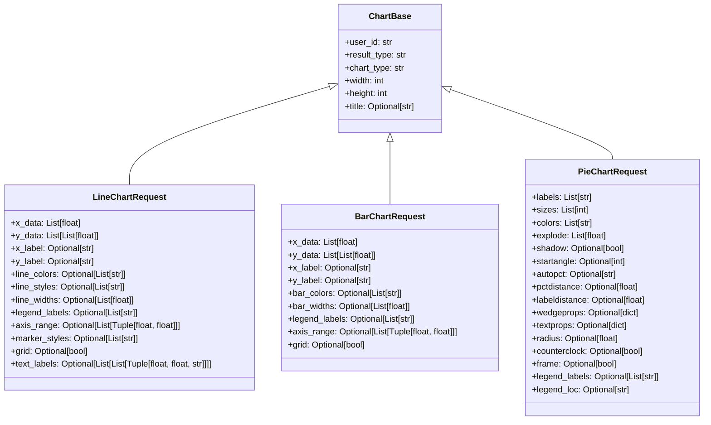
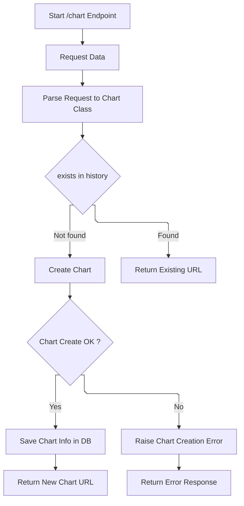

# Eliana

## 개요

1. chart server
   1. 사용자로부터 chart를 그리는 데이터(json)를 받아서 그것으로 chart 이미지를 만들고 url 또는 stream을 리턴한다.
   2. 사용자는 화면에서 테스트 데이터로 만들어질 챠트를 확인하고.
   3. 자신이 작성하는 application에서 json데이터를 Eliana로 보내서 챠트 이미지를 만들게 하고 url또는 stream을 리턴받아서 표현한다.

2. 기술스택
   * FastAPI
   * Matplotlib
   * SqlLite
   * tailwind
   * jquery
  
## 개발환경

### 가상환경 설정

```
    python -m venv env
    . ./env/Scripts/activate
```

### 라이브러리 설치

```
pip install fastapi uvicorn
pip install matplotlib
pip install jinja2
pip install -e .

## pip관련 명령어
```

pip freeze > requirements.txt
pip install -r requirements.txt
pip install --upgrade fastapi httpx
pytest > ~/tmp/eliana_test_results.txt 2>&1
pytest -W ignore::DeprecationWarning

```

```

## 데이터베이스

* sqlite 를 사용 : eliana.db
* 테이블들
  * chart_sample : chart type에 따라서 사용자들에게 json 데이터이 형식을 제공
  * chart_history : chart가 만들어 질 때마다 레코드가 추가되며 똑같은 데이터에 대해서는 이미 만들어진 chart의 url을 제공

### 실행

```
ELIANA_MODE=local
uvicorn --app-dir src main:app --reload --port 8989
#uvicorn main:app --reload --port 8989

source .env
uvicorn main:app --reload --port $ELIANA_PORT
```

## 환경설정

### .env

```text
ELIANA_MODE=LOCAL
ELIANA_PORT=8989
```

### 테스트

* pytest

```
pytest
pytest -s test_module1.py
pytest --capture=no  -W ignore::DeprecationWarning
```

* swagger

 ```
 http://localhost:8989/docs

{
  "type": "url",
  "width": 300,
  "height": 200,
  "x": ["2024-01","2024-02","2024-03","2024-04","2024-05"],
  "y": [23,45,53,32,65]
}
```

### debugging

## 개발 내용

1. sqlite 사용
   * eliana.db : 같은 폴더에 생성
   * chart_history : 사용자가 생성한 chart history
   * chart_sample  : 챠트 샘플들 즉 구현된 챠트종류, 사용자는 이것을 수정해서 사용할 수 있다.

2. 환경변수 : ELIANA_MODE 사용
3. log폴더 안에 eliana.log 생성

## 챠트 클래스



## 챠트 생성 로직

* /chart
* POST방식으로 각 챠트에 대한 json 데이터 전송



## 새로은 챠트의 추가

1. 아래 line chart를 위한 클래스를  참조하여 pie챠트의 클래스를 만들어 주세요

```python
class ChartBase(BaseModel):
    user_id: str
    result_type: str = 'url'  # url과 stream 두 가지
    chart_type: str
    width: int = 800
    height: int = 600
    title: Optional[str] = None

class LineChartRequest(ChartBase):
    chart_type: str = 'line'
    x_data: List[float]
    y_data: List[List[float]]
    x_label: Optional[str] = None
    y_label: Optional[str] = None
    line_colors: Optional[List[str]] = None
    line_styles: Optional[List[str]] = None
    line_widths: Optional[List[float]] = None
    legend_labels: Optional[List[str]] = None
    axis_range: Optional[List[Tuple[float, float]]] = None
    marker_styles: Optional[List[str]] = None
    grid: Optional[bool] = None
    text_labels: Optional[List[List[Tuple[float, float, str]]]] = None
```

* json

```json
{
  "user_id": "user123",
  "result_type": "url",
  "chart_type": "pie",
  "title": "Example Pie Chart",
  "data": [25, 35, 20, 15, 5],
  "labels": ["Category A", "Category B", "Category C", "Category D", "Category E"],
  "colors": ["red", "green", "blue", "orange", "purple"],
  "explode": [0, 0.1, 0, 0, 0],  // Category B 조각만 조금 돌출시킴
  "startangle": 90,
  "autopct": "%1.1f%%"
}
```

## 폴더 구조

| 디렉토리   | 설명                                                                                     |
|----------|----------------------------------------------------------------------------------------|
| `.vscode` | Visual Studio Code 설정 파일이 저장되는 디렉토리입니다. 에디터 설정, 디버깅 구성 등을 포함합니다. |
| `assets`  | 웹 프로젝트에서 사용되는 정적 자원들을 저장하는 디렉토리입니다. `css`, `fonts`, `image`, `js` 서브디렉토리 포함. |
| `charts`  | 생성된 차트 이미지 파일들을 저장하는 디렉토리입니다. 예: `2024/03`과 같은 연도/월별 서브디렉토리 구조. |
| `doc`     | 프로젝트 문서화 파일들을 저장하는 디렉토리입니다. 프로젝트 설명, 사용 방법, API 문서 등 포함. |
| `env`     | Python 가상 환경 디렉토리입니다. 프로젝트를 위해 설치된 Python 인터프리터와 라이브러리가 포함됩니다. |
| `log`     | 애플리케이션 로그 파일들을 저장하는 디렉토리입니다.                                          |
| `src`     | 소스 코드를 포함하는 주 디렉토리입니다. `exception`, `model`, `routers`, `utils` 등의 서브디렉토리 포함. |
| `templates` | HTML 템플릿 파일들을 저장하는 디렉토리입니다. `Jinja2` 같은 템플릿 엔진 사용 시. `common`, `form`, `sample` 등 서브디렉토리 포함. |
| `__pycache__` | Python 인터프리터가 생성하는 컴파일된 바이트코드 파일들을 저장하는 디렉토리입니다. 실행 속도 향상을 위함. |

## 새로운 챠트의 생성

* 예를 들어 PIE챠트를 만들려고 한다.
* 주요 수정 파일 : eliana_util.py, ChartRequest.py, chart_util.py

1. "Matplotlib 로 파이챠트를 만들 때 데이터를 최대한 많은 옵션을 넣어서 json으로 만들어 주세요
2. 이 JSON 데이터를 FASTApi에서 받았다고 할때 Pydantic 모델 클래스를 만들어 주세요
   이때 설명을 필드 옆에 주석으로 넣어주세요.
3. 이 모델에 해당하는 임의의 데이터를 채워주세요. option 필드들도 모두 채워주세요
4. 챠트 생성로직에 준해서 pie chart생성해 주세요
5. chart-aside.html 수정
