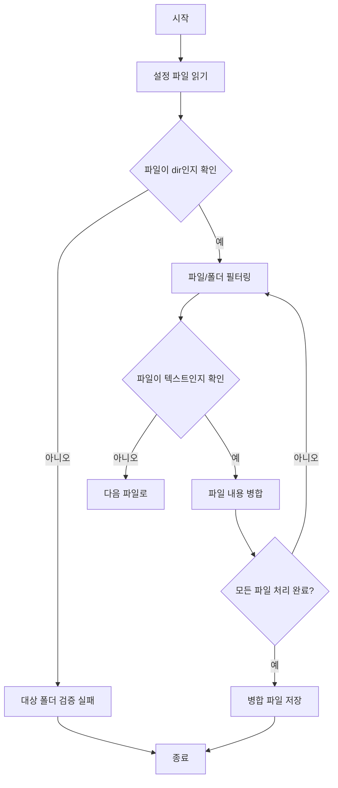

# gather-all

## 기능
다음과 같은 프로그램을 만들고 싶어요.
기능은 대상폴더의 모든 파일을 읽어서 1개의 파일로 만드는 것임.

조건은 다음과 같음
1. 프로그램명은 gather_all
2. 실행시 인자로 config을 입력받음 예를 들어 gatherall a.config 와 같이 실행함.
3. 인자가 없으면 usage 메세지를 보여주고 종료
4. config 파일 a.config는 다음과 같은 구조로 되어 있음

## config파일
```
#  대상폴더
target-folder=c:\tmp
# 대상 파일들 *는 모든 문자열을 의미
target-files=*.java;*.css;*.html;web.xml
# exclude 할 파일들
exclude-files=assemble.obj; *.class
# 생성될 파일
c:/kdy/source1.dat
```
### 실제
```
# eliana python 
# method는 list와 merge가 있음
method=list
target-folder=C:\Users\deHong\Documents\kdy\python-practice\eliana
target-files=*.py;*.md
# 배제할 폴더나 파일, 폴더인 경우 끝부분을 / 여야함.
exclude-files=.vscode/;__pychache__/;env/;venv/;.gitignore
output-file=c:\tmp\eliana-all-source.py  
```

### 사용법

```
python gather_all test1.config
```

## 로직의 흐름 
