# OMS(Lucy) 프로젝트

## 1. Lucy 프로젝트의 개요

### 1.1 프로젝트의 명칭

OMS(주문관리시스템)을 추구하면서 개발되었으며 개발코드명으로 Lucy라는 명칭을 사용하였습니다. 개발이 완료되는 시점에
AssetERP에 추가되는 형식으로 프로젝트가 계획되었으므로 공식적인 명칭은 갖고 있지 않습니다.
이하 **Lucy**라는 명칭을 사용합니다.

※ 본 문서는 2024.12에 작성 됨

### 1.2 프로젝트이 기간과 투입인원

기간 : 2024.3.1 ~ 2024.12.31
설계 : 천영임부장(1인)
개발 : 김도영부장(1인)

### 1.3 Lucy의 목표

Lucy의 목표는 Restful방식으로 증권사가 제공하는 OpenAPI를 이용하여 운용사가 AssetERP를 통해서 주문을 넣고
체결이 되면 통보를 받는 것을 1차목표로 합니다.
최종적으로는 운용사의 정해진 자금과 분배계획에 따라서 여러 증권사에 주문을 넣고 체결통보를 받는 것입니다.

### 1.4 Lucy의 개발과정

Lucy는 2개의 증권사 즉 한국투자증권과 LS증권(이베스트투자증권)을 대상으로 open api를 통해서 주문을 넣고 체결통보를 받는 것을
시도하였는데, 기타 증권사들은 Restful방식으로 OpenAPI를 제공하고 있지 않기 때문이었습니다.(2024.3 기준 참조-[증권사별 openapi제공현황](https://www.bluestones.biz/cms/pages?action=view&page=/HomePage/stock/stock_products.md))
2개의 증권사를 제외하면 대부분의 증권사들이 윈도우 기반의 OCX,DLL,COM등의 기술로 open api를 제공하고 있습니다.
윈도우기반의 기술은 웹으로 구현하기 용이하지 않으므로 Lucy의 개발에는 적용을 고려하지 않았습니다.

Restful OpenAPI를 제공하는 2개의 증권사 api는 법인과 개인을 구별하여 서비스를 제공합니다. 그러나 개발과정에서 법인으로
개발하기가 용이하지 않아서 (법인은 openapi 키발급이 개인보다 엄격함, 법인으로 개발시 실제적인 거래를 하기 쉽지 않음 )
개발자 개인으로 open api key를 발급받아서 개발을 진행하였습니다.

참고로 두 개의 증권사 모두 모의계좌를 제공하지만 실제로 개발을 진행하다보면 모의계좌로 개발을 진행하는 것은 여러가지 제약조건이 있습니다
그래서 개발진도상 모의계좌로 진행하기가 어려웠습니다.

### 1.5 목표 미달의 사유

Lucy의 구현 내용이 작지는 않지만 그래도 실질적으로 AssetERP에 적용할 수 없어서 만족할 수 있는 상황에 이르지 못한 것에는
아래와 같은 사유가 있습니다

1. Restful API방식의 OpenAPI를 제공하는 증권사가 2개밖에 존재하지 않는다.
2. 명확한 설계를 갖고 있지 않다. 즉 운용사가 실제적으로 OMS를 어떤 식으로 원하는지 구체적인 요구사항이 존재하지 않는다.
3. 법인을 대상으로 개발을 해야했지만 상기 기술한 바와 같이 법인으로 개발하기 쉽지 않은 환경이었습니다.

### 1.6 개발 내용 (주요기능)

초기 상정했던 목표에 미달하였지만 Lucy는 아래와 같은 기능을 갖도록 구현되었습니다.
개인이 한국투자증권과 LS증권에 계좌를 갖고 있으며 Open API 키를 발급받은 상태여야 합니다

#### 주요기능

1. 로그인
2. 계좌 내용을 조회
3. 매수/매도 주문
4. 체결통보 및 체결정보 조회
5. 주식종목 조회
6. 공모주 일정 및 내용 조회
7. 사용자정보 관리

## 2. 기술스택(Tech Stack)

### 2.1 기술 개요

Lucy는 파이썬언어를 기반으로 개발되었으며 현재 한국펀드서비스(주)의 AssetERP의  메인 개발 언어인 java 기반의 기술과는 다른
환경과 개발방법을 가지고 개발되었습니다.
그래서 AssertERP의 개발자의 이해를 높이기위해서 java기술스택과 비교하는 방식으로 기술합니다.
괄호 안의 기술은 Lucy에 사용된 기술과 대응하는 기술입니다.

Lucy는 아래와 같은 기술적 특징을 갖고 있습니다.

1. 백엔드(Backend) 와 프런트엔드(Frontend)를 모두 갖고 있음
2. [FastAPI](https://fastapi.tiangolo.com/ko/)로 개발됨
3. [MongoDB](https://www.mongodb.com/ko-kr)를 [Beanie](https://beanie-odm.dev/) [ORM](https://gmlwjd9405.github.io/2019/02/01/orm.html) 으로 사용
4. 자체 스케줄러를 갖고 있음
   1. [주달](https://www.judal.co.kr/) 사이트 scrapping
   2. [38커뮤니케이션](https://www.38.co.kr/) 사이트 scrapping IPO정보 취득
5. [JWT](https://ko.wikipedia.org/wiki/JSON_%EC%9B%B9_%ED%86%A0%ED%81%B0) 인증
6. 웹소켓 : 체결정보를 서버로부터 수신하기 위하여 사용됨
7. 자체적인 스케줄러를 갖고 있슴

### 2.1 백엔드 기술 (Backend)

- 프로그래밍 언어 : python 3.12 (java 1.8)
- 웹프레임워크 : FastAPI (GWT)
  - python은 웹프레임워크는 Django,Flask,FastAPI 3가지가 주요 프레임워크이며 FastAPI가 가장 최근에 개발되어졌습니다.
  - FastAPI가 비동기를 지원한다는 점과 가장 빠르다는 의견때문에 선정하였습니다.(참고: [python 웹프레임워크비교](https://www.hanbit.co.kr/channel/category/category_view.html?cms_code=CMS5997817104))
- 웹서버 : [Uvicorn](https://www.uvicorn.org/) (Tomcat)
  - 통칭 **ASGI**(Asynchronous Server Gateway Interface)서버라고 하며 fastAPI를 돌리기 위해서는 필수적으로 사용됩니다.

- DBMS : MongoDB(PostgreSQL)
  - no-sql database로 R-DBMS와 비교하여 비정형데이터를 다루기 용이합니다.
  - 주식정보데이터 즉 증권사가 제공하는 데이터가 변경되기 쉽다는 점에서 선정하였습니다.

- 템플릿 엔진 : jinja2(java 대응 기술 없슴) 서버쪽 template 엔진으로 python 계열의 웹어플리케이션에 널리 사용되고 있습니다.

- 미들웨어 : JWT를 기반으로 인증처리, Static파일들 처리

### 2.2 프런트엔트 기술 (Frontend)

- CSS프레임워크 : [bootstrap5](https://getbootstrap.com/) ( GXT )
- 템플릿 엔진 : [handlebar](https://handlebarsjs.com/) (없음)
- DOM handling : jquery (없음)
- javascript자체의 fetch 함수 : API 통신

### 2.3 FastAPI 웹프레임워크

- Lucy는 FastAPI 웹프레임워크를 기반으로 자체적인 프레임워크(개발방법)을 구축했습니다.

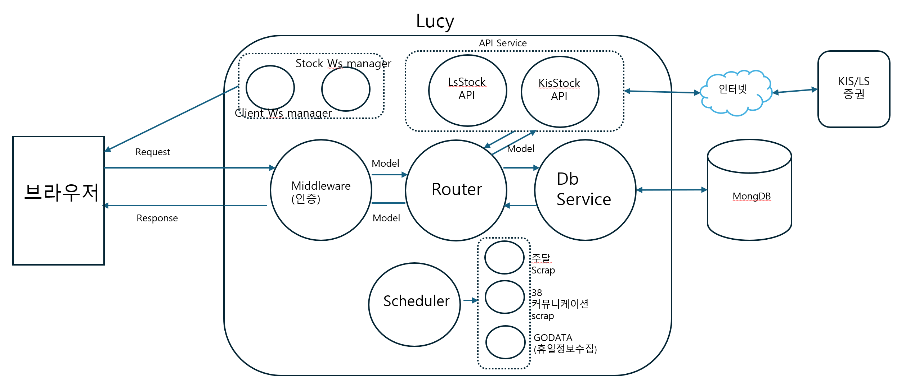

- 스케줄러에서 구동되는 모듈을 제외한 모든 모듈이 async로 동작합니다.
- Lucy는 기본적으로 MVC모델을 따라서 설계되었으며 Request는 Router에서 해석되어
  Service 모듈에서 필요한 정보를 획득한 후 사용자에게 전송합니다. 이때 정보의 단위는 model단위로 전송됩니다.

#### 2.3.1 각 모듈의 설명

1. Middleware
   1. 실제 구현체 : jwtmiddleware.py
   2. 기능
      - request의 header를 해석하여 인증합니다.
      - Lucy에서는 권한에 따른 기능 제한은 없습니다.

2. Router 모듈들
   - client로부터 요청받는 서비스(method와 parameter)를 받아서 각 service모듈을 호출하여 응답(json)을 client에 리턴해 줌
3. Db Service 모듈들
   - Database와의 동작을 담당하면 각 테이블당 1개씩의 Service를 갖고 있음.
4. Api Service 모듈
   - 증권사(KIS,LS)의 open api를 호출함
5. Websocket 모듈들
   - 증권사와의 websocket연결 및 client와의 websocket연결을 담당
6. Scheduler
   - judal scrapping및 커뮤니케이션38사이트 스크래핑을 관리
  
#### 2.3.2 디렉토리 구조

- Lucy는 backend와 frontend를 모두 가지고 있습니다.
- backend는 backend폴더에, frontend는 frontend 폴더 하위에 존재합니다.
- backend의 특징
  - backend는 Restful api 서버와 같이 동작합니다
  - page url에 대해서 jinja2를 이용하여 페이지를 rendering해서 html을 보내줍니다.
  - backend 디렉토리 구조

```text
|-- backend
|   |-- app
|   |   |-- api
|   |   |   `-- v1
|   |   |       `-- endpoints
|   |   |-- background
|   |   |   `-- jobs
|   |   |-- core
|   |   |   `-- exception
|   |   |-- domains
|   |   |   |-- ipo
|   |   |   |-- judal
|   |   |   |-- stc
|   |   |   |   |-- kis
|   |   |   |   |   `-- model
|   |   |   |   `-- ls
|   |   |   |       `-- model
|   |   |   |-- system
|   |   |   `-- user
|   |   |-- managers
|   |   `-- utils
```

- backend 각 폴더의 설명
  - app/api/v1/endposts : router들 즉 Restful api 서버와 같이 url,method에 대한 서비스제공
  - app/api/background : 스케줄러가 호출하는 프로그램들
  - app/api/core : middleware, logger, exception등
  - app/api/domain : router가 사용하는 service 및 model 들 (DTO)
  - app/api/managers : websocket manager들
  
- frontend의 특징
  - template 엔진으로 handlebar를 사용
  - javascript 자체의 fetch함수를 사용
  - bootstrap5 css library의 사용
  - jquery 사용
  
- frontend 디렉토리 구조

```text
`-- frontend
    |-- public
    |   |-- css
    |   |-- images
    |   `-- js
    |       `-- kis
    `-- views
        |-- common
        |-- handlebar
        |   |-- kis
        |   |-- ls
        |   `-- mystock
        `-- template
            |-- config
            |-- danta
            |-- ipo
            |-- judal
            |-- kis
            |-- ls
            |-- mystock
            |-- scheduler
            `-- user
```

- frontend 각 폴더의 설명
  - public : static 파일들 즉 javascript, css, image 들 보관
  - views/common : nav.html등 공통 화면
  - handlebar : client에서 data와 함께 rendering 되어야할 handlebar script들
  - templates : server side에서 rendering되어야 할 페이지들

- 기타 폴더들
  - doc : 관련 문서들
  - data: 산출되는 data들
  - data/judal : judal사이트에서 scrapping한 파일들을 날짜별로 보관

## 3. 프로젝트 상세

### 3.1 프로그램의 시작

- Lucy는 기본적으로 fastAPI로 작성된 web 어플리케이션입니다.
- /backend/main.py 에서 시작됩니다.
- tomcat에 해당하는 역활을 하는 [uvicorn](https://www.uvicorn.org/)에 의해서 구동됩니다.
- main.py는 다음과 같은 순서로 수행됩니다.

```text
  1. 미들웨어의 설정(client인증수행)
  2. router 설정 : 서비스 endpoints 설정
  3. web server start/end event 핸들러설정
     - start시 mongo db의 연결
     - end 시 mongo db의 close
  4. static_files 설정 : js, image, css 폴더 설정
  5. exception handler 설정
```

### 3.2 config 및 JWT인증

- cleint와의 인증은 JWT(Json Web Token)을 사용합니다
- /login router에서 jwt token을 발급합니다.
- 유효시간은 config에서 설정된 값에 의해서 제한됩니다
- config는 .env_{profile}에 저장된 값을 사용합니다.
- profile은 환경변수에 LUCY_MODE에 설정된 값입니다.
    즉 set LUCY_MODE=real이면 .env_real 파일을 읽어서 각 변수의 값을 설정합니다.
- config는 프로젝트 전반에 걸쳐서 사용됩니다.
- git repository에 .env_{profile}은 배포되어서는 안되며, .gitignore에 설정되어 있습니다.

```python
class Config:
    def __init__(self):
        self.PROFILE_NAME = os.getenv('LUCY_MODE', 'local')
        load_dotenv(dotenv_path=f'.env.{self.PROFILE_NAME}')

        ...
        self.DEFAULT_USER_ID = os.getenv('DEFAULT_USER_ID', 'kdy987')
config = Config()
```

### 3.3 각 증권사와의 인증

- RESTful api를 사용하기 위해서는 [KIS](https://apiportal.koreainvestment.com/intro), [LS](https://openapi.ls-sec.co.kr/intro) 각 증권사에 1)**계좌가 존재**해야 하고 2)**사용자 등록**을 해야하고 3)**Key를 발급**받아야 합니다
- KIS 및 LS 증권사는 개인 사용자에게는 24시간, 법인 사용자에게는 1달의 유효기간을 갖는 키를 발급합니다.
- 두 증권사 모두 유사한 방식으로 인증을 처리합니다.

  ```text
    1. APP_KEY와 APP_SECRET_KEY 2개의 키를 발급함.
    2. 두 개의 키를 header에 넣어서 token발급 서비스를 요청하면 access token을 발급해 줌
    3. 이후 토큰의 유효시간 내에서 token을 header의 authorization에 넣고 기타 서비스를 호출
  ```

- Lucy에서는 mongo DB에 APP_KEY와 APP_SECRET_KEY를 저장하여 사용합니다.
- 발급받은 ACCESS_TOKEN 역시 mongo db에 저장하여 사용하며 만료 시간 초과시 다시 발급받고 다시 저장하는 방식으로 동작합니다.

### 3.4 KIS 증권 api

- 부모 클래스 StockApi로 부터 상속받습니다. 즉 StockApi의 자식 클래스입니다.

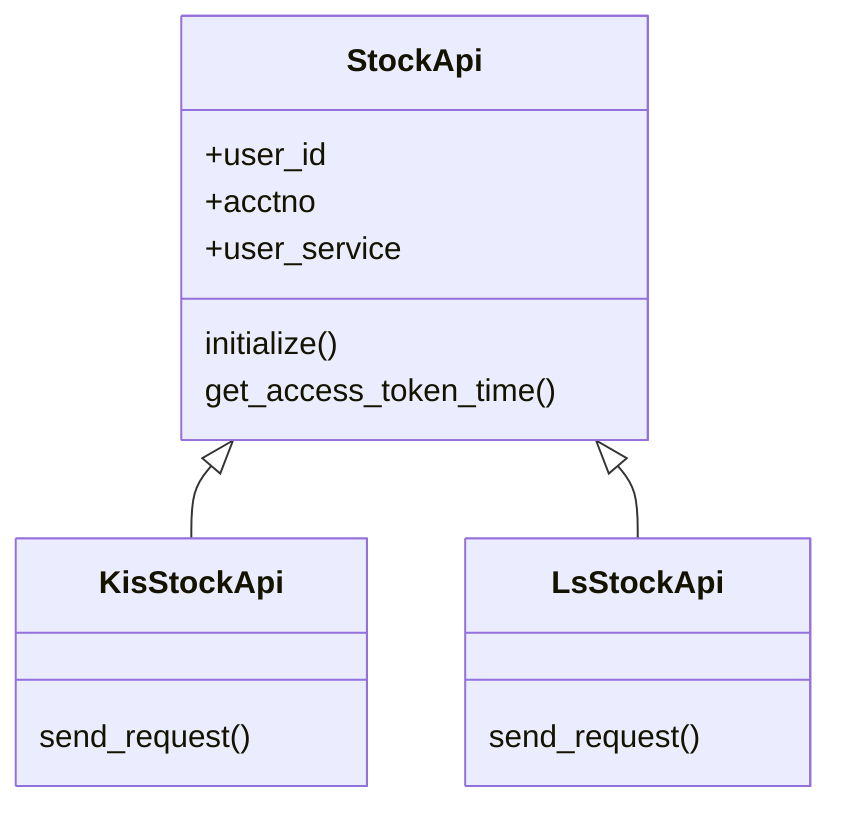

- KIS 증권과의 api를 위해서 KisStockApi class 작성하여 사용합니다.
- 파일명 : kis_stock_api.py
- [KIS에서 제공하는 RestfulAPI](https://apiportal.koreainvestment.com/apiservice/oauth2#L_5c87ba63-740a-4166-93ac-803510bb9c02)의 각 서비스를 호출합니다.
- 많은 method가 있지만 동일한 구조를 갖고 있습니다.
- KisStockApi의 주요 메소드
  - set_access_token_from_kis : 동기(sync)방식으로 ACCESS_TOKEN을 발급받고 몽고 DB에 저장함
  - send_request : 기타 함수(class method)에서 이 메소드를 호출하여 KIS에 서비스를 요청함.
    - KIS는 GET, POST 2개의 method(http)만을 제공함

```python
    async def send_request(self, title, method, url, headers, params=None, data=None):
        try:
            async with aiohttp.ClientSession() as session:
                if method == 'GET':
                    async with session.get(url, headers=headers, params=params) as response:
                        response.raise_for_status()
                        return await response.json()
                elif method == 'POST':
                    async with session.post(url, headers=headers, data=data) as response:
                        response.raise_for_status()
                        return await response.json()
        except aiohttp.ClientError as e:
            logger.error(f"HTTP 오류 ({title}): {e}")
            raise KisApiException(status_code=500, detail=f"HTTP 오류 ({title}): {e}")                    
        except json.JSONDecodeError as e:
            logger.error(f"Response is not in JSON format.{title}")
            raise InvalidResponseException(f"응답 내용이 JSON형식이 아닙니다 ({title})")
```

- 각 서비스는 KIS에서 제공하는 문서에 따른 서비스를 호출하기 위해 header와 params또는 data를 설정한 후 send_request를  호츨하는 것으로 구현했습니다.
- 아래는 stk_code를 인자로 하는 [현재가를 구하는  함수](https://apiportal.koreainvestment.com/apiservice/apiservice-domestic-stock-quotations2#L_07802512-4f49-4486-91b4-1050b6f5dc9d)의 예 입니다.

```python
    async def current_cost(self, stk_code:str) -> InquirePrice_Response:
        ''' 현재가 조회 '''
        url = self.BASE_URL +  '/uapi/domestic-stock/v1/quotations/inquire-price' 
        headers = {"Content-Type":"application/json", 
                "authorization": f"Bearer {self.ACCESS_TOKEN}",
                "appKey":self.APP_KEY,
                "appSecret":self.APP_SECRET,
                "tr_id":"FHKST01010100"}
        params = {
            "fid_cond_mrkt_div_code":"J",
            "fid_input_iscd":stk_code,
        }
        json_response = await self.send_request('현재가 조회', 'GET', url, headers, params=params)
        self.check_access_token(json_response)
        logger.debug(f"현재가: {stk_code} : {json_response['output']['stck_prpr']}")
        try:
            return InquirePrice_Response(**json_response)
        except ValidationError as e:
            raise HTTPException(status_code=500, detail=f"받은 json 파싱 오류: {e}")    
```

- 사용방법

  ```python
    kis_api = await StockApiManager().kis_api()
    cost = await kis_api.get_current_price(stk_code) 
  ```

### 3.5 LS 증권 api

- 부모 클래스 StockApi로 부터 상속받습니다. 즉 StockApi의 자식 클래스입니다.
- LS증권의 제공되는 API를 사용하기 위해서 KIS와 유사하게 LsStockApi class가 작성되었습니다.
- KIS와 유사한 방식으로 작성되었습니다.
- 파일명 : ls_stock_api.py
- [LS에서 제공하는 RestfulAPI](https://openapi.ls-sec.co.kr/apiservice?group_id=ffd2def7-a118-40f7-a0ab-cd4c6a538a90&api_id=33bd887a-6652-4209-88cd-5324bc7c5e36)의 각 서비스를 호출합니다.
- LS에서 제공하는 서비스를 구현한 다수의  method가 있지만 동일한 구조를 갖고 있습니다.
- KisStockApi의 주요 메소드
  - set_access_token_from_kis : 동기(sync)방식으로 ACCESS_TOKEN을 발급받고 몽고 DB에 저장함
  - send_request : 기타 함수(class method)에서 이 메소드를 호출하여 KIS에 서비스를 요청함.
    - KIS는 GET, POST 2개의 method(http)만을 제공함

### 3.6 StockApiManager

- Lucy(OMS시스템)은 **여러명의 사용자가 다수의 증권사에 주문을 내고 체결통보를 받는다** 는 조건으로 설계되었습니다.
- 즉 다수의 사용자, 각 사용자별로 다수의 증권사 계정을 관리하여야 합니다.
- 이런 관리를 담당하는 것이 StockApiManager입니다.
- 로그인 된 사용자 계정에 대해서 요청된 서비스가 KIS 서비스인지, LS 서비스인지 판별하여 해당하는 StockApi 객체를 반환해 주는 역활을 합니다.
- 싱글레톤으로 구현되어 있습니다.

### 3.7 WebSocket Managers

- KIS, LS 증권사들은 실시간 데이터를 Websocket을 사용하여 제공하고 있습니다.
- 증권사들이 실시간으로 데이터를 제공하는 것에는 stkcode에 대한 실시간 가격정보와 체결정보가 있습니다.
- 실시간 가격정보는 Lucy에서 사용하지 않으며 **체결정보만**을 사용합니다.
- Lucy에서는 사용자별로 증권사의  websocket의 client로서 동작하는 **StockWsManager** 가 있습니다.
- Lucy에서는 사용자 즉 접속한 Browser의 서버로서 동작하는 **ClientWsManager** 가 있습니다.
- 동작순서
  1. 사용자가 웹소켓 endpoint /ws에 접속
  2. ClientWsManager 생성
  3. 증권사별 StockWsManager의 생성 이때 2.에서 생성된 ClientWsManager를 인자로 넘겨 줌
  4. 3.에서 생성된 StockWsManager는 증권사로부터 계속 실시간 데이터를 기다리고 있음
     (참고: 실시간 가격정보는 계속 데이터가 전송되어져 오고, 체결정보는 체결시에만 데이터가 옴)
  5. 증권사에서 체결정보가 전송되었을 때 StockWsManager는 자신에게 알려진 client로 체결정보를 전송함.

### 3.8 Core 모듈들

- Lucy(fastApi 서버)를 구성하는 모듈들 입니다.
- 목록(backend/app/core)
  1. config : .env<profile>에서 상수값들을 loading해서 사용가능하게 함.
  2. exception_handler : request에 대한 예외처리를 담담함.
  3. jwtmiddleware : reqeust에 대한 인증처리 jwt를 사용
  4. logger : 로깅처리 config에 설정된 파일에 로그를 남기며 profile이 local일 경우에는 console에도 로그를 남김
  5. mongodb : 몽고db의 초기화와 close담담
  6. scheduelr : cron 작업을 관리
  
### 3.9 Scheduler

- Lucy는 현재 4개의 작업을 cron동작으로 작업하도록 하고 있습니다.
- **SchedulerJobService** 클래스와  **Scheduler** 클래스가 주요 클래스입니다.
- Scheduler는 Apscheduler의 BackgroundScheduler을 사용합니다.
- SchedulerJobService가  Scheduler클래스를 가지고 있으며 실제적으로 job등록등의 기능을 수행합니다.
- 비동기작업이 아닙니다. 즉 scheduler에 의해서 구동되는 프로그램이 동작하고 있는 동안은 fastapi의 서비스가 지연됩니다.
- 작업목록은 DB에  보관되며 Lucy가 기동될 때 Scheduler에 등록됩니다.
- SchedulerJobService의  가장 주요한 method는 **register_system_jobs**입니다.
  1. DB에서 등록된 job 데이터를 loading한다.
  2. jobmapper와 연결된 job을 Scheduler클래스에 등록한다.

- 작업목록

1. site38_work : 커뮤니케이션38 스크래핑 (공모주 정보)
2. holiday_godata : 휴일정보
3. fil_ls_stk_info :  LS stk_info 정보 채우기
4. judal_fetch : [Judal사이트](https://www.judal.co.kr/)에서 정보를 스크래핑

### 4.0 frontend framework

- template 엔진으로 handlebar를 사용했습니다.
- css framework로 bootstrap5를 사용했습니다.
- jQuery를 사용했습니다.
- page 이동의 router는 home_router입니다
- home_router는 다음과 같은 endpoint를 갖고 있습니다.
      - /main: 메인 페이지
      - /page: path에 해당하는 페이지를 가져와서 보낸다.
      - /template: path에 해당하는 html에서 body추출해서 jinja2처리한 JSON을 리턴
      - /login: 로그인 페이지
      - /logout: 로그아웃 페이지
      - /login: 로그인 프로세스

- 페이지 rendering
  - /page url에 path를 인자로 주어서 page를 이동하니다.
  - 예를 들어 /page?path=/ipo/ipo-card 일 경우 /frontend/views/template하위의 폴더 ipo의 ipo-card.html 을 jinja2로 rendeing해서 보여주게 됩니다.

  ```html
    <li><a class="nav-link" href="/page?path=ipo/ipo-card">공모주-상세</a></li>  
  ```

    1. base folder : /frontend/views/template
    2. base folder + path 값에 해당하는 html페이지를 찾음
    3. 최종 ipo-card.html을 jinja2의 소스로 사용
    4. jinja2 로 rendering된 html을 리턴해 줌. 이때 rendering에 사용되는 값들은 아래와 같습니니다

```python
    context = {
        "request": request, 
        "today" : today,
        "page_path": path, 
        "user_id": current_user["user_id"], 
        "user_name": current_user["user_name"],
        "stk_code" : stk_code
    }
    # id = ipo_calendar 와 같은 형식이고 이를 분리한다.
    template_path = path.lstrip('/') 
    template_page = f"template/{template_path}.html"
    logger.debug(f"template_page 호출됨: {template_page}")
    return render_template(template_page, context)    
```

- template rendering

  - template란 handlebar의 template를 의미합니다.
  - 상기 기술한 /page url에서 rendering되는 페이지는 실제적인 데이터를 갖고 있지 않습니다.
  - 단, document 가 준비되면 필요한 데이터를 가져오는 구조로 되어 있습니다.
    1. 화면에 보여줄 데이터를 가져온다.
    2. handlerbar를 이용해서 rendering.한다.

```javascript
    function display_mystocks() {
        fetch("/api/v1/mystock")
        .then(response => response.json())
        .then(data => {
            $("#list-area").empty();
            //2. 가져온 데이터는 handlerbar를 이용해서 rendering한다.
            var template = Handlebars.compile($("#mystock_list_template").html());
            $("#list-area").html(template({list: data}));
        })
        .catch(error => {
            console.log(error);
        });
    }
    $(document).ready(function() {
        ....
        display_mystocks(); //1. 화면에 보여줄 데이터를 가져온다.
    });
```

- /template url
  - 상기 기술한 기본적인 페이지 rendering외에 /template url로 handlebar의 소스 script를  가져와서 사용 할 수 있습니다.
  - handlebar 소스 script가 너무 복잡할 경우, 페이지에 너무 많은 handlerbar 소스 script가 존재할 경우, 여러 곳에서 사용하는 handlerbar 소스 script일 경우 유용합니다.

### 4.1 frontend 주요 javascript 모듈

- billboard_candle_chart.js : naver에서 제공하는 open source [billboard](https://naver.github.io/billboard.js/release/latest/doc/)를 사용하여 candle 챠트를 그리는 모듈
- calendar-utiliity.js : 달력을 그리고 해당하는 날짜의 ipo정보를 표시
- common.js : 프로젝트 전반에 걸쳐서 사용되는 javascript utility함수들 모음
- fetch-util.js : Lucy에서는 javascript자체의 fetch함수를 사용하며 그 fetch함수를 베이스로 만든 유틸리티 함수들
- handlebar-helpers.js : handlebar 헬퍼함수 모음
- ipo_helper : IPO용 handlebar 헬퍼함수 모음
- lucy_main.js : lucy에서 공통으로 사용되는 화면과 관련된 javascript함수들
  - 매수/매도 canvas 함수
  - alert 함수
  - 회사정보 canvas 함수

  ```javascript
    window.showBuySellCanvas = showBuySellCanvas;
    window.showToastError = showToastError;
    window.showCompanyCanvas = showCompanyCanvas;
    window.showAlertError = showAlertError;
  ```  

  - lucy_websocket.js : 서버 (lucy backend)로부터 받는 websocket 데이터를 위한 함수들
  - tab-manager: tab ui를 위한 함수

### 4.2 데이터 베이스

- Lucy는 [몽고데이터베이스](https://www.mongodb.com/ko-kr)를 사용합니다.
- 몽고DB를 async 방식으로 사용하기 위해서 [beanie](https://beanie-odm.dev/)사용
- DB명 : stockdb
- Collections 과 대응하는 schema
  - Config (config_model) : 설정정보를 저장
  - EventDays (eventdays_model) : GODATA에서 open api를 통해서 가져온 휴일정보
  - Ipo (ipo_model) : ipo 일정정보 및 상세 정보등 커뮤니케이션38사이트에서 얻은 ipo관련 정보
  - IpoHistory (ipo_history_model) : 상장된 ipo일정에 대해서 예상체결가를 산정하기 위한 정보
  - SchedulerJob (schduler_job_model) : 스케줄러에 등록될 job 정보
  - Users (user_model) : 사용자의 계좌정보등

## 4. 사용자 화면 설명

### 4.1 개요

사용자 화면은 처음 기획과는 달리 법인사용자가 아닌 개인 사용자로 작성되었으며, 매수/매도 주문, 체결통보외에 IPO관련 메뉴를 갖고 있으며, 미완성기능으로 단타머신의 기능이 있습니다.
또한, KIS,LS의 여러 api를 호출하여 데이터를 가져와서 보여주는 기능이 있습니다.
그러나 제공되는 데이터의 2차 가공 및 의미있는 판단을 내리는 기능은 없습니다.

또한 단타머신은 자동으로 매수/매도의 기능을 수행하고 telegram을 통해서 사용자에게 information을 주도록 기획했으나 실효성의 문제(즉 자동으로 수행시 손실이 클 수 있음)와
시간상의 문제로 개발 중에 프로젝트가 되게 되었습니다.

### 4.2 메뉴 구성 및 설명

- 공모주
  - 공모주 - 상세 : 공모주 내용 표시
  - 공무주 - 달력 : 달력 상에 공모주 일정 (청약일,환불일,상장일) 표시
  - 공모주 - 기록 : 지난 공모주와 상장일 최고액 표시 및 예상체결가 공식 산출
- 종목찾기
  - My Stock : 주식 종목을 보유/관심/단타로 구분하여 표시, 10초마다 현재가를 갱신
  - 주달검색  : 주달사이트에서 scrapping한 데이터로 검색
  - 외국인 매매조목 : 외국인 매매 중 상위 종목 표시
  - 증권사-투자의견 : 증권사의 투자의견를 회원사별 괴리율 별로 표시
  - KIS-관심종목 : KIS(한국투자증권)의 HTS를 통해서 추가한 관심그룹과 속한 종목 표시
  - KIS-조건식 : KIS의 HTS를 통해서 등록한 조건식의 조회 및 조건식을 수행한 결과 표시
  - KIS-상위종목 : KIS의 시간외호가잔량과 호가잔량을 조회
  - LS-상위종목 : LS증권사의 등락률,거래량 등으로 금일/전일의 상위종목 조회
- 단타머신 : 단타머신 관리페이지
- 한국투자증권
  - KIS 계좌 : 등록된 한국투자증권 계좌의 상태 및 보유 종목에 대한 금액정보 표시
  - 일별주문체결 : 일자로 체결된 정보 조회
- LS증권
  - LS계좌 : 등록된 계좌의 상태와 보유 종목에 대한 금액정보 표시
  - 거래내역 : 일자로 거래내역 및 체결정보 조회

- 나의 주식정보 : 주식종목을 보유/관심/단타로 분류하여 현재가를 표시, 10초마다 가격정보를 실제 가격으로 조회
- 설정 및 스케줄 : 설정 및 Scheduler 정보 표시 및 수정
- 사용자 정보 : 사용자의 기본정보와 계좌정보를 표시 수정

### 4.3 화면 캡쳐 및 설명

#### 4.3.1 로그인 / 메인화면

- **로그인**
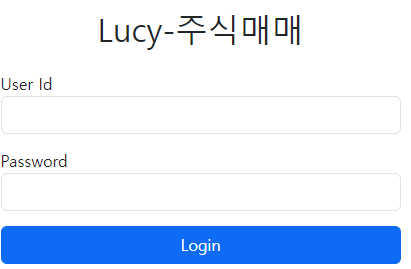

  - id/pw 로그인시 /login url호출 jwt token을 발급받음.
  - fulldown 메뉴를 사용
  - login사용자 표시

- **메인화면**
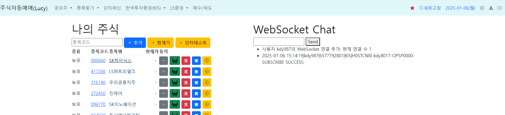

  - fulldown menu를 사용함.
  - 나의 주식 상황과 Websocket연결상태를 표시

#### 4.3.2 공모주

- **공모주-목록(상세)**
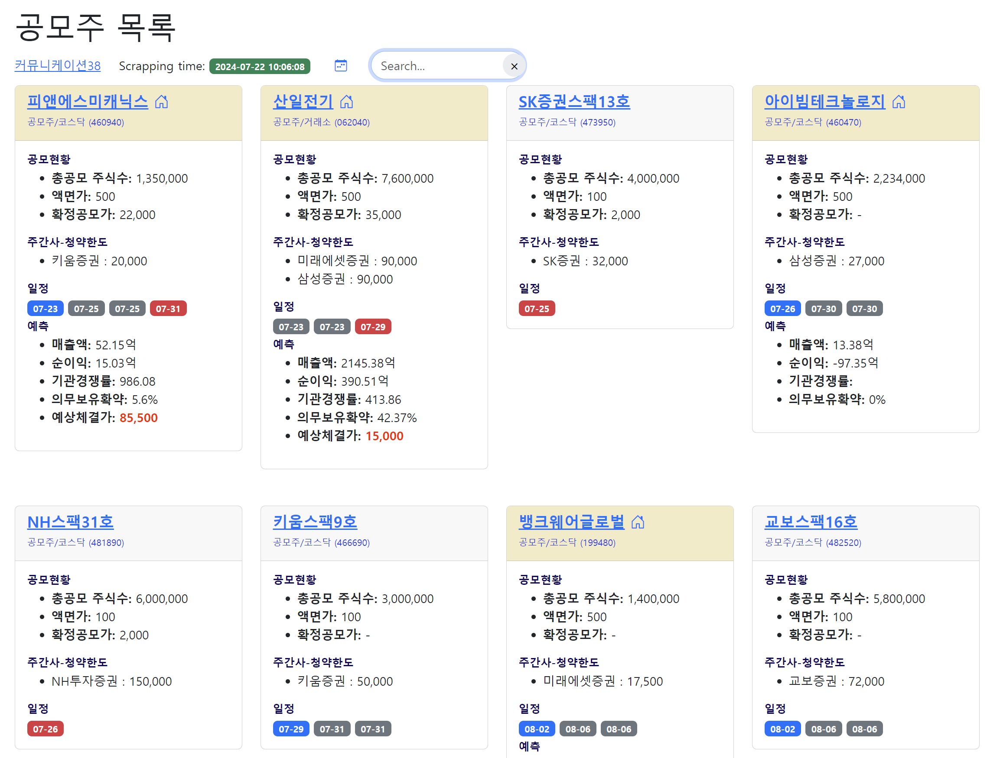

  - 커뮤니케이션38에서 scrapping한 데이터를 보여줌.
  - 스팩은 다른 스타일로 보여줌
  - 예상체결가를 구할 수 있는 것은 IPO과거데이터 기록을 참조하여 생산한 수식으로 계산하여 산출
  - 찾기기능과 최근 scrapping일시를 보여줌

- **공모주-달력**
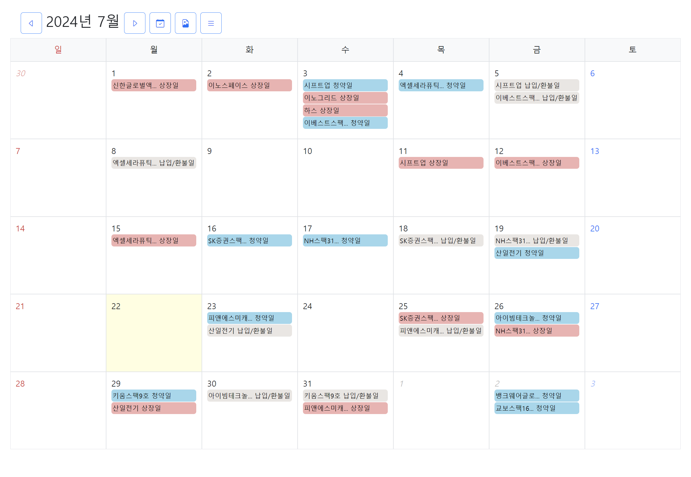
  - 달력에 공모주 청약일,환불일,상장일을 표시

- **공모주 과거데이터 기록**
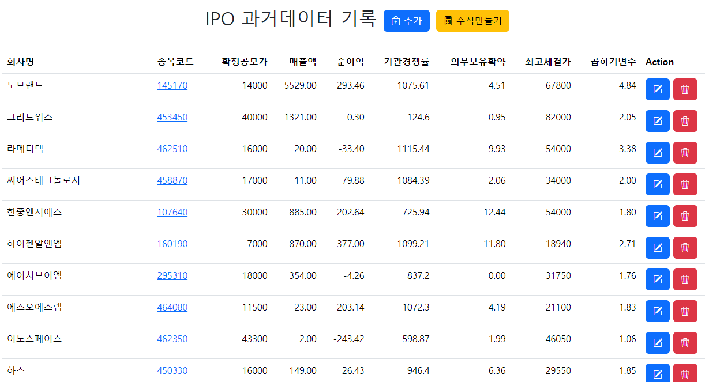

  - 공모주 상장일에 최고체결가를 확인해서 수식을 만듬.
  - 수식은 선형회귀식을 사용함.
  - 인자로 사용된 항목은 확정공모가, 매출액, 기관경쟁률, 의무보유확약임.
  - 수식만들기버튼을 클릭하면 현재까지 축적된 데이터로 선형회귀식을 만듬.
  - 만들어진 데이터는 db의 Config collection에 저장됨

  ```json
    {
    "key": "ipo_expected_cost_express",
    "mode": "System",
    "value": "(2.925374714862828e-05 * 매출액) + (0.0016757608759126886 * 기관경쟁률) + (0.008617509095604907 * 의무보유확약) + 0.6401964822960602",
    "note": "체결예상가_배율을  매출액, 기관경쟁률, 의무보유확약 3가지로 공모가의 배율을 구하는 공식",
    "editable": true
    }
  ```

  - 수식은 ipo-목록(상세)에서 예상체결가를 구하는데 사용됨
  
  #### 4.3.3 종목찾기

  - 종목찾기는 투자종목을 선택하기 위해서 여러가지 소스에서 자료를 검색합니다.
  - 검색한 자료에서 선택하여 나의 주식(My Stock)에 추가하여 관리합니다.
  
  - **나의 주식**
  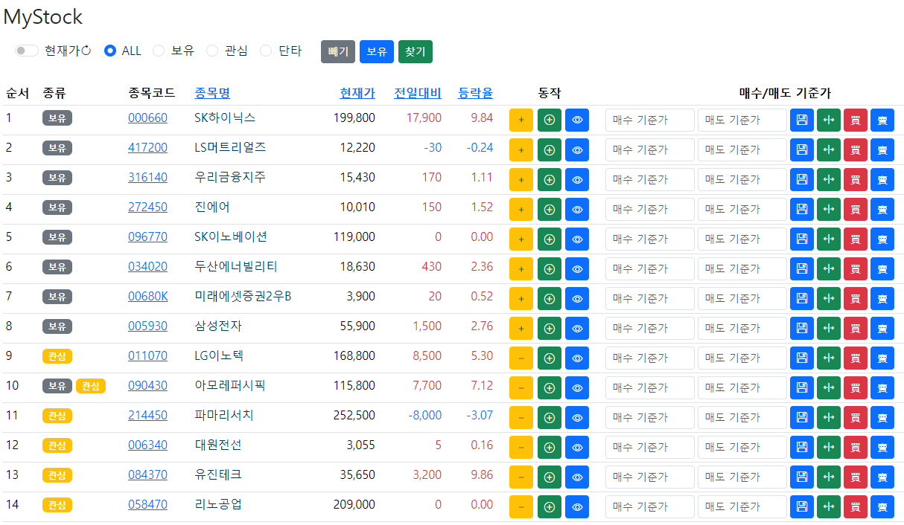
  - 나의 주식은 보유,관심,단타 3가지 분류에 다중으로 소속되며 현재가는 장중일때 10초마다 갱신합니다.
  - 보유버튼은 현재 사용자의 KIS,LS의 계좌내용을 검색해서 자동으로 보유 태그를 각 주식 종목에 부여합니다.
  
  - **주달검색**
  - 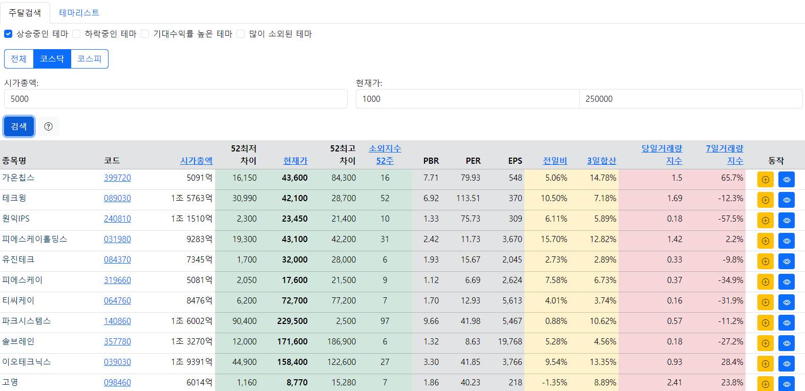
  - [주달](https://www.judal.co.kr/)사이트의 내용을 scheduler에서 정해진 시간에 scrapping하여 data/judal폴더에 날짜별로 저장합니다.
  - 저장된 데이터는 csv파일의 형태로 저장됩니다
  - 저장된 데이터 중 가장 최근의 데이터를 사용하여 각 종목을 검색할 수 있습니다.
  
  - **외국인 매매 종목**
  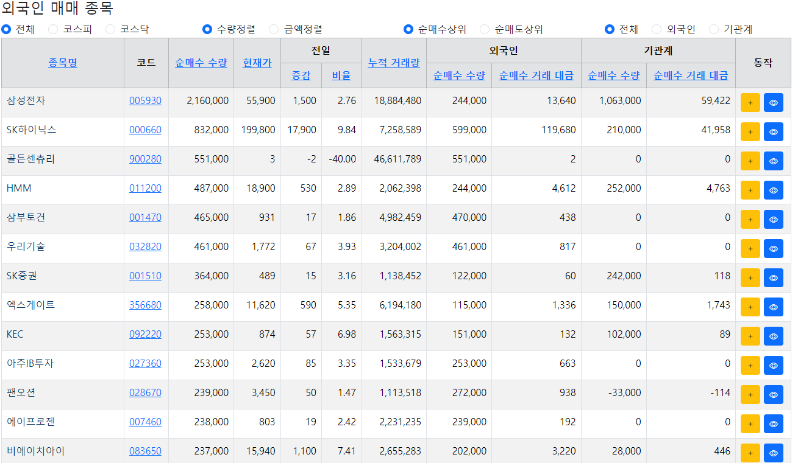
  - 한국투자증권의 api중 '국내기관_외국인->매매종목가집계'을 이용하여 데이터를 보여준다.
  
  - **증권사 투자의견**
  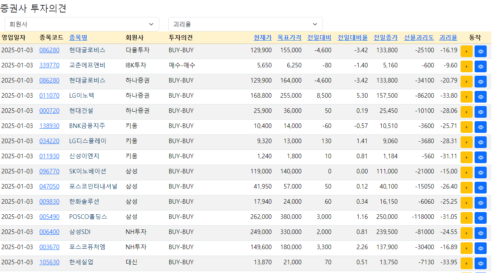
  
  - 한국투자증권의 api중 '국내주식 종목투자의견'을 이용하여 데이터를 보여준다.
  
  - **KIS관심종목 그룹**
  

  - KIS(한국투자증권)의 HTS에서 관심종목 그룹을 만들고 각 그룹에 종목을 추가했을 경우
  - 그룹의 목록과 그룹별로 추가된 종목을 표시합니다.
  
  - **KIS 조건식**
  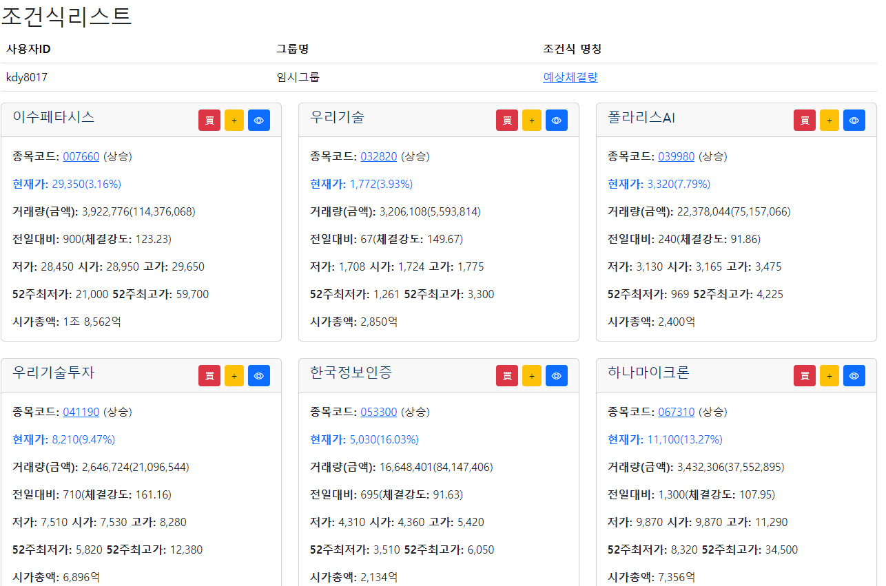

  - KIS HTS에서 추가한 조건식리스트를 보여주고 클릭시 조건식이 수행되면서 검색한 종목들을 표시합니다.

  - **KIS 상위종목**
  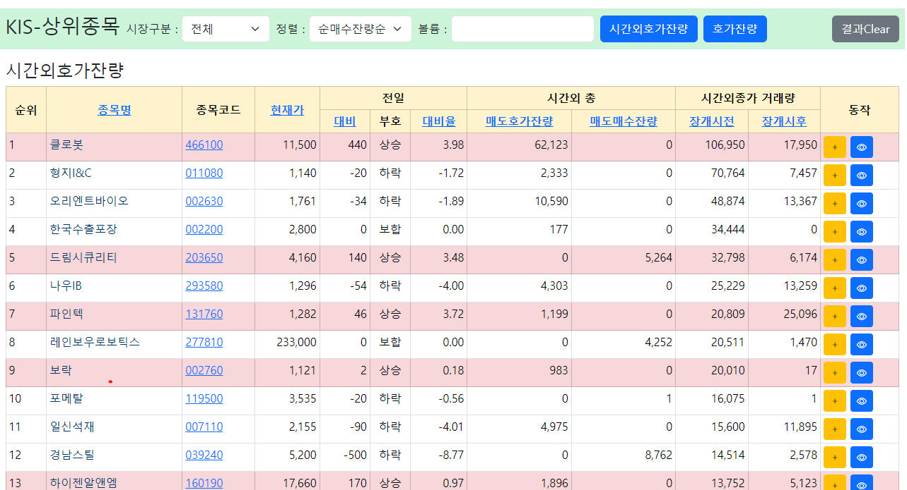

  - 한국투자증권의 api중 '시간외호가잔량순위'과 '호가잔량순위' api를 이용하여 종목을 검색하여 표시합니다.
  
  - LS-상위종목
  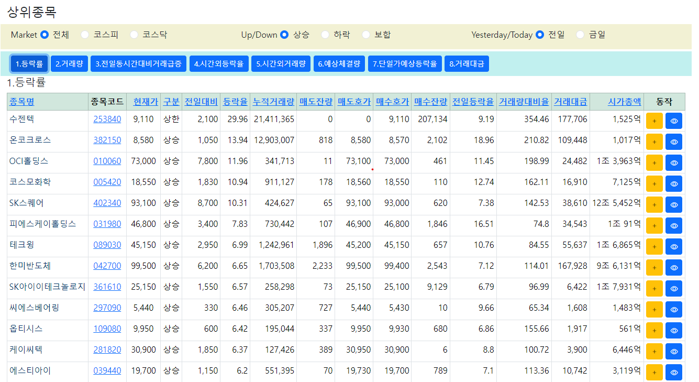

  - LS 증권에서 제공하는 각 지수별로 상위종목을 표시합니다.
  - 지수는 등락률, 거래량, 전일동시간대비 거래급증, 시간외등락율, 시간외거래량, 예상체결량, 당일가예상등락율, 거래대금 입니다.
  
  #### 4.3.4 한국투자증권

  - 한국투자증권 계좌에 대한 정보를 표시합니다.
  
  - KIS계좌
  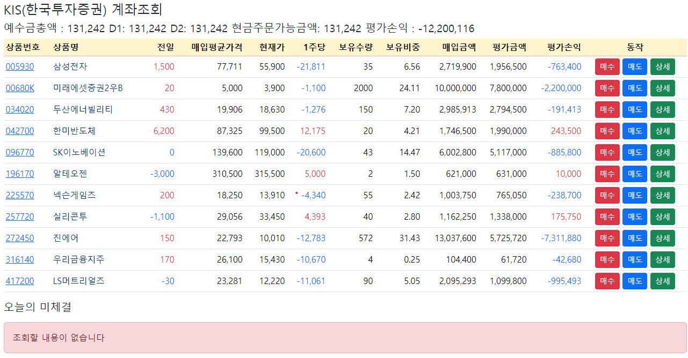
  - 사용자의 한국투자증권 계좌의 계좌정보(예수금등)와 보유 종목의 목록과 종목의 현재가등을 표시합니다.
  - 만약 매수/매도의 현재가가 아닌 금액으로 주문을 넣었을 경우 오늘의 미체결에 표시합니다.
  